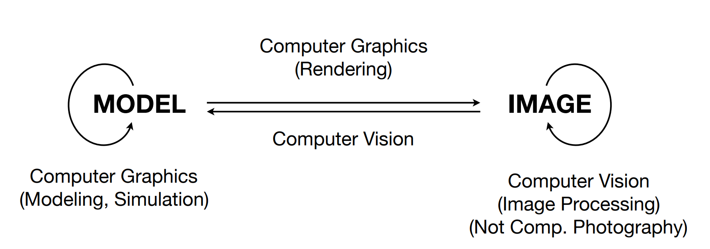

# GAMES101-Notes
> - [课程主页](https://sites.cs.ucsb.edu/~lingqi/teaching/games101.html)
> - [B站视频](https://www.bilibili.com/video/BV1X7411F744/?spm_id_from=333.337.search-card.all.click&vd_source=02d17afa86e1a24aea6ec3147fc08936)

----

 ## Technical Challenges

- Math of (perspective) projections, curves, surfaces 
- Physics of lighting and shading 
- Representing / operating shapes in 3D  
- Animation / simulation
- ~~3D graphics software programming and hardware~~

---

## Course Topics (mainly 4 parts)

- Rasterization(光栅化)：将三维空间的几何形体显示在屏幕上
- Curves and Meshes(几何)
-  Ray Tracing(光线追踪)：真实画面 trade-off 慢 —> 实时光线追踪
-  Animation / Simulation(动画/仿真)

==一切需要猜测的内容就是计算机视觉，如语义分割/目标检测/场景理解==

