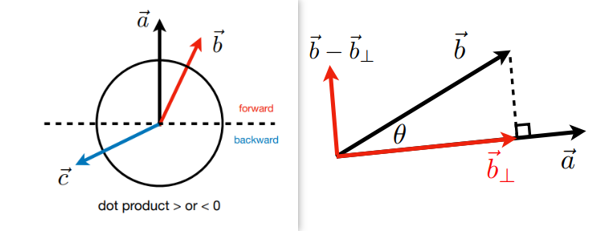

# Math

- [A Swift and Brutal Introduction to Linear Algebra](#A-Swift-and-Brutal-Introduction-to-Linear-Algebra)
  - [Dot Product in Graphics](#Dot-Product-in-Graphics)
  - [Cross Product in Graphics](#Cross-Product-in-Graphics)
  - [Orthonormal bases and coordinate frames](#Orthonormal-bases-and-coordinate-frames)

- [Transformation](#Transformation)
  - [Matrices](#Matrices)
  - [2D transformations](#2D-transformations)
  - [Homogeneous coordinates](#Homogeneous-coordinates)
  - [Composing transforms](#Composing-transforms)
  - [  3D transformations](#3D-transformations)

- [Viewing transformation](#Viewing-transformation)
  - [View/Camera transformation](#View/Camera-transformation)
  - [Projection transformation](#Projection-transformation)
    - [Orthographic projection](#Orthographic-projection)
    - [Perspective projection](#Perspective-projection)

## A Swift and Brutal Introduction to Linear Algebra

- Basic Mathematics
  - Linear algebra, calculus, statistics
- Basic physics
  - Optics, Mechanics
- Misc
  - Signal processing
  - Numerical analysis

### Dot Product in Graphics

- Find angle between two vectors
- Find **projection** of one vector on another

- Measure how close  two directions are

- Decompose a vector
- Determine forward/backward

### Cross Product in Graphics

$$
\vec{a}\times \vec{b}=-\vec{b}\times \vec{a} \\
||\vec{a}\times \vec{b}||=||\vec{a}||||\vec{b}||\sin{\theta}
$$

- Cross product is orthogonal to two initial vectors 
- Direction determined by right-hand rule
- Useful in constructing coordinate systems

- Determine left / right

- Determine inside / outside $\vec{AB} \times \vec{AP}, \vec{BC} \times \vec{BP}, \vec{CA} \times \vec{CP} $ 

**corner case, up to you**

### Orthonormal bases and coordinate frames

## Transformation

- Modeling: translation/rotation/scaling
- Viewing: (3D to 2D) projection

### Matrices

- **Non-commutative**: AB and BA are different in general

- Associative and distributive  
  - $(AB)C=A(BC)$
  - $A(B+C) = AB + AC$
  - $(A+B)C = AC + BC$

- $(AB)^ T = B^T A^T$
- $AA^{-1}= A^{-1}A=I$
- $(AB)^{-1}=B^{-1}A^{-1}$

- Vector multiplication in Matrix form

### 2D transformations

#### Representing transformations using matrices

----

**Scale Matrix**

----

**Reflection Matrix**

----

**Shear Matrix（切变）**

----

**Rotation Matrix**

旋转矩阵的逆就是它的转置：正交矩阵 $A^{-1} = A^T$

----

**Linear Transforms（线性变换） = Matrices**

----

**Translation（平移）**：不是线性变换，无法写成矩阵形式

### Homogeneous coordinates

----

**Definition**

向量具有平移不变性

- vector + vector = vector
- point - point = vector
- point + vector = point 点沿着向量移动
- point + point = ?? (point) 两个点的中点

$$
\left(\begin{array}{c}
x \\
y \\
w
\end{array}\right) \text { is the } 2 \mathrm{D} \text { point }\left(\begin{array}{c}
x / w \\
y / w \\
1
\end{array}\right), w \neq 0
$$

---

**Affine Transformations（仿射变换）**

- Affine map = linear map + translation

$$
\left(\begin{array}{c}
x' \\
y' \\
\end{array}\right) 
=
\left(\begin{array}{c}
a & b \\
c & d\\
\end{array}\right)
\cdot
\left(\begin{array}{c}
x \\
y \\
\end{array}\right) 
+ 
\left(\begin{array}{c}
t_x \\
t_y \\
\end{array}\right)
$$

- Using homogenous coordinates

$$
\left(\begin{array}{c}
x' \\
y' \\
1
\end{array}\right) 
=
\left(\begin{array}{c}
a & b & t_x \\
c & d & t_y \\
0 & 0 & 1
\end{array}\right)
\cdot
\left(\begin{array}{c}
x \\
y \\
1
\end{array}\right)
$$

---

**2D Transformations**

----

**Inverse Transform**  逆矩阵

### Composing transforms

组合变换

---

**Transform Ordering Matters**

---

**从右到左相乘**

矩阵没有交换律，但有结合律

---

**Decomposing Complex Transforms**

先变换到原点处，再进行变换

###   3D transformations

---

**Homogeneous coordinates representation**

先进行旋转变换，再进行平移变换

$$
\left(\begin{array}{l}
x^{\prime} \\
y^{\prime} \\
z^{\prime} \\
\end{array}\right)=\left(\begin{array}{lllc}
a & b & c \\
d & e & f \\
g & h & i \\
\end{array}\right) 
\cdot
\left(\begin{array}{l}
x \\
y \\
z \\
\end{array}\right)
+
\left(\begin{array}{l}
t_x \\
t_y \\
t_z \\
\end{array}\right)
$$

----

**3D Transformation Matrices**

循环对称性：  $R_y: z\times x \rightarrow y$

----

**Rodrigues’ Rotation Formula** 矩阵 –>  轴角表达

## Viewing transformation

> 观测变换

### View/Camera transformation

### Projection transformation

> 投影变换

#### Orthographic projection

> 正交投影

#### Perspective projection

> 透视投影

