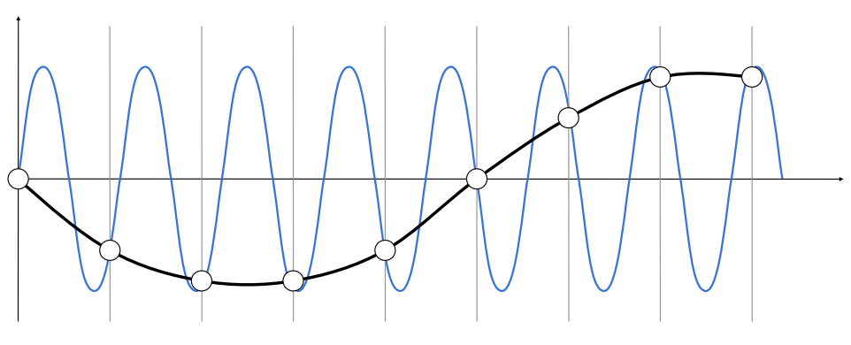

# Rasterization

- [Rasterization 1: Triangles](#Rasterization-1:-Triangles)
  - [Perspective Projection](#Perspective-Projection)
  - [Canonical Cube to Screen](#Canonical-Cube-to-Screen)
  - [Rasterization: Drawing to Raster Displays](#Rasterization:-Drawing-to-Raster-Displays)
- [Rasterization 2: Antialiasing and Z-Buffering](#Rasterization-2:-Antialiasing-and-Z-Buffering)
  - [Antialiasing](#Antialiasing)
    - [Sampling theory](#Sampling-theory)
    - [Antialiasing in practice](#Antialiasing-in-practice)

[toc]

## Rasterization 1: Triangles

> 当做完View Transformation后，所有场景都在标准立方体里。下一步就是光栅化：将其画在屏幕上

### Perspective Projection

- *定义视锥*：宽高比、视角$fovY$

- MVP: 将场景转换到标准立方体内

### Canonical Cube to Screen

----

**Screen**

- What is a screen?
  - An array of pixels
  - Size of the array: resolution 分辨率 $1920 \times 1080$
  - A typical kind of raster display
- Raster（光栅） == screen in German
  - Rasterize == drawing onto the screen
- Pixel (FYI, short for “picture element”) 
  - For now: A pixel is a little square with uniform color 最小的单位
  -  Color is a mixture of (red, green, blue)

- **Screen space**

----

**Viewport transformation: 视口变换**

>  与z轴无关，直接拉伸，并移动中心到$(w/2, h/2)$

> 经过视口变换后，下一步就是将各种多边形网格转换为单一的像素

### Rasterization: Drawing to Raster Displays

- Polygon Meshes

- Triangle Meshes

----

**Triangles - Fundamental Shape Primitives**

- Why triangles?
  - Most basic polygon 最基础的多边形
    - Break up other polygons
  - Unique properties
    - Guaranteed to be planar 平面
    - Well-defined interior 内外明确
    - Well-defined method for interpolating values at  vertices over triangle (barycentric interpolation)  内部插值方便
- What Pixel Values Approximate a Triangle?

    

----

**A Simple Approach: Sampling** 采样策略：把函数离散化的过程

- Sample If Each Pixel Center Is Inside Triangle 注意考虑的是像素的中心点

    
    

- Inside? Recall: Three Cross Products!  （右手螺旋定则）
  - $P_0P_1\times P_0Q$ : 外  
  - $P_1P_2\times P_1Q$：外
  - $P_2P_0\times P_2Q$：内

- Edge Cases (Literally)：up to you

- 检查所有像素 –> Incremental Triangle Traversal
  - 左边：包围盒(蓝色区域)  根据三点的最小和最大的$x$和$y$获取包围盒，也叫**AABB**（axis-aligned Bounding Box）
  - 右边：每一行设计一个AABB

    

----

**Aliasing  锯齿**：抗锯齿（反走样）根据是否在三角形内为像素确定颜色，存在锯齿

 

- 锯齿（走样）

 

## Rasterization 2: Antialiasing and Z-Buffering
> 反走样 深度缓冲

### Antialiasing
#### Sampling theory

---

**Sampling is Ubiquitous（广泛存在的） in  Computer Graphics**

- Rasterization = Sample 2D Positions
- Video = Sample Time

----

**Sampling Artifacts  (Errors / Mistakes / Inaccuracies) in  Computer Graphics**

- Jaggies (Staircase Pattern） 存在锯齿
- Moiré Patterns in Imaging 摩尔纹
- Wagon Wheel Illusion (False Motion) 车轮效应

Behind the Aliasing Artifacts：**本质都是因为信号变化太快了，以至于采样速度跟不上**

- Signals are changing too fast (high frequency),  but sampled too slowly

----

**Antialiasing Idea:  Blurring 模糊 (Pre-Filtering) Before  Sampling**

- 模糊处理（滤波）

> 先采样，再进行模糊处理呢？不行

-----

**Frequency Domain（频域）**

- 根据$f$（频率）可以定义波变化的快慢

- 傅里叶级数展开: 任何一个周期函数都可以写成一系列正弦、余弦函数和常数的组合

- 傅里叶变换（Fourier Transform）：将任何信号分解为频率

- 高频需要更快的采样才能保证恢复出的函数更接近原始函数

- “aliases”：在不同频率信号（蓝色，黑色）上使用相同的策略进行采样（空心点），导致我们无法区分这两个信号，这就是“走样”。

----

**Filtering（滤波） = Getting rid of  certain frequency contents（将某些特定频率去除）**

- 傅里叶变换将实域变为频域：低频集中在中间，高频信息在外围(边缘处)

- High-pass filter（高通滤波）：去除低频信息 —> 边缘特征

- Low-pass filter （低通滤波）：去除高频信息 –> 模糊处理（存在水波纹）

- 去除最高和最低范围的信号

----

**Filtering （滤波）= Convolution（卷积）  (= Averaging 平均化）**

- Convolution：加权平均处理

- Convolution Theorem: Convolution in the spatial domain is equal to multiplication  in the frequency domain, and vice versa **实域上的卷积等于在频域上的乘积，反之也成立**
  - Filter by convolution in the spatial domain
  - Transform to frequency domain (Fourier transform)
  - Multiply by Fourier transform of convolution kernel
  - Transform back to spatial domain (inverse Fourier)

- Box Filter：滤波，要进行归一化(1/9)，保证亮度不变

Box Function = “Low Pass” Filter 低通滤波器

Wider Filter Kernel = Lower Frequencies 卷积核越大，在图像上进行滤波会越模糊，其本身的频率越低

---

**Sampling（采样） = Repeating  Frequency Contents（重复频域上的内容）**

- 采样：给定原始信号a，经过采样后留下部分信号

- Aliasing（**走样**） = Mixed Frequency Contents 交错的频域内容（采样不够快）

#### Antialiasing in practice

**How Can We Reduce Aliasing Error?**

- Increase sampling rate 加快采样速率：昂贵，高分辨率
  - Essentially increasing the distance between replicas in the  Fourier domain
  - Higher resolution displays, sensors, framebuffers… 
  - But: costly & may need very high resolution
- Antialiasing 反走样
  - Making Fourier contents “narrower” before repeating
  - i.e. Filtering out high frequencies before sampling 采样前滤去高频信号

*Antialiasing = Limiting, then repeating*：去除高频信号（频谱缩小），再进行采样

-----

**Antialiased Sampling**

- A Practical Pre-Filter
  - A 1 pixel-width box filter (low pass, blurring) 一像素的滤波器

- Antialiasing By Averaging Values in Pixel Area 模糊处理：卷积操作，平均化
  - Convolve f(x,y) by a 1-pixel box-blur
    -  Recall: convolving = filtering = averaging
  - Then sample at every pixel’s center

*In rasterizing one triangle, the average value inside a pixel  area of f(x,y) = inside(triangle,x,y) is equal to the area of the  pixel covered by the triangle.* 

> 计算覆盖度并不容易，所以需要找一种近似操作。

-----

**Antialiasing By Supersampling  (MSAA)**：反走样近似操作

- Supersampling：对一个像素划分为更多的像素（假想提升分辨率），然后进行覆盖近似

- Result: （没有提高分辨率，没有提高采样率，只是更合理的覆盖度）

- **No free lunch!**
  - What’s the cost of MSAA? 计算量
- Milestones (personal idea)
  - FXAA (Fast Approximate AA) 工业界使用
  - TAA (Temporal AA) 工业界使用
-  Super resolution / super sampling
  - From low resolution to high resolution
  - Essentially still “not enough samples” problem
  - DLSS (Deep Learning Super Sampling)

