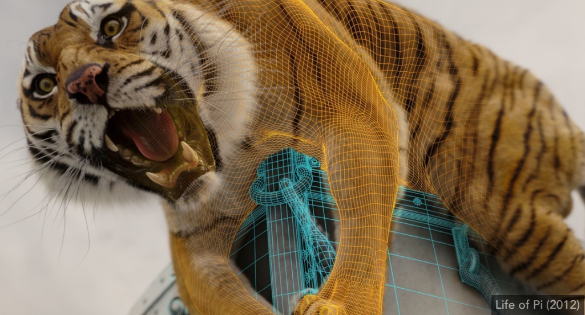

# Rasterization

- [Rasterization 1: Triangles](#Rasterization-1:-Triangles)
  - [Perspective Projection](#Perspective-Projection)
  - [Canonical Cube to Screen](#Canonical-Cube-to-Screen)
  - [Rasterization:  Drawing to Raster Displays](#Rasterization: -Drawing-to-Raster-Displays)

## Rasterization 1: Triangles

> 当做完View Transformation后，所有场景都在标准立方体里。下一步就是光栅化：将其画在屏幕上

### Perspective Projection

- *定义视锥*：宽高比、视角$fovY$

- MVP: 将场景转换到标准立方体内

### Canonical Cube to Screen

----

**Screen**

- What is a screen?
  - An array of pixels
  - Size of the array: resolution 分辨率 $1920 \times 1080$
  - A typical kind of raster display
- Raster（光栅） == screen in German
  - Rasterize == drawing onto the screen
- Pixel (FYI, short for “picture element”) 
  - For now: A pixel is a little square with uniform color 最小的单位
  -  Color is a mixture of (red, green, blue)

- **Screen space**

----

**Viewport transformation: 视口变换**

>  与z轴无关，直接拉伸，并移动中心到$(w/2, h/2)$

> 经过视口变换后，下一步就是将各种多边形网格转换为单一的像素

### Rasterization:  Drawing to Raster Displays

- Polygon Meshes

- Triangle Meshes

----

**Triangles - Fundamental Shape Primitives**

- Why triangles?
  - Most basic polygon 最基础的多边形
    - Break up other polygons
  - Unique properties
    - Guaranteed to be planar 平面
    - Well-defined interior 内外明确
    - Well-defined method for interpolating values at  vertices over triangle (barycentric interpolation)  内部插值方便
- What Pixel Values Approximate a Triangle?

    

----

**A Simple Approach: Sampling** 采样策略：把函数离散化的过程

- Sample If Each Pixel Center Is Inside Triangle 注意考虑的是像素的中心点

    
    

- Inside? Recall: Three Cross Products!  （右手螺旋定则）
  - $P_0P_1\times P_0Q$ : 外  
  - $P_1P_2\times P_1Q$：外
  - $P_2P_0\times P_2Q$：内

- Edge Cases (Literally)：up to you

- 检查所有像素 –> Incremental Triangle Traversal
  - 左边：包围盒(蓝色区域)  根据三点的最小和最大的$x$和$y$获取包围盒，也叫**AABB**（axis-aligned Bounding Box）
  - 右边：每一行设计一个AABB

    
    

   

----

**Aliasing  锯齿**：抗锯齿（反走样）

    
    

    

