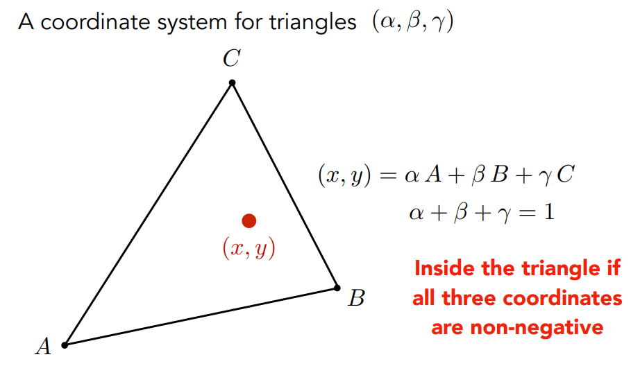
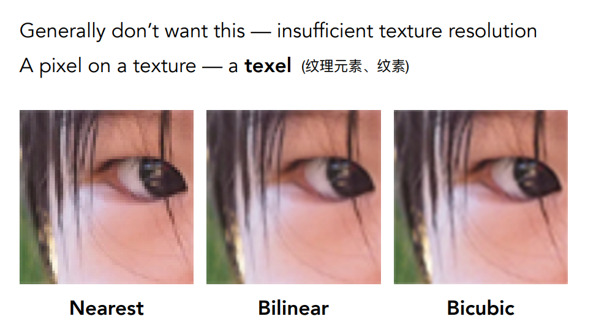
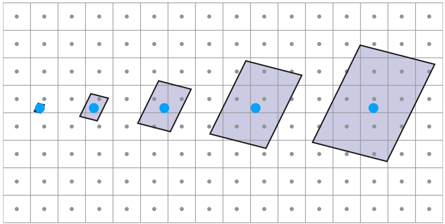
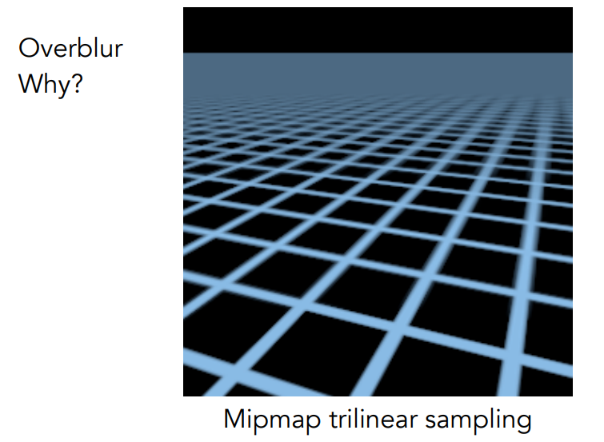

# Shading

> 着色

- [Illumination, Shading and Graphics Pipeline](#Illumination,-Shading-and-Graphics-Pipeline)
  - [Visibility / occlusion](#Visibility-/-occlusion)
    - [Z-buffering](#Z-buffering)

  - [Shading](#Shading)
    - [Illumination & Shading](#Illumination-&-Shading)
    - [Graphics Pipeline](#Graphics-Pipeline)

  - [Texture Mapping](#Texture-Mapping)

## Illumination, Shading and Graphics Pipeline

> 光照，着色，图形管线

Rasterization

- ​	Rasterizing **one triangle**
- Sampling theory
- Antialiasing

### Visibility / occlusion

 **Painter’s Algorithm**：先对远处物体进行光栅化，再处理近处的物体，新的会覆盖原有的东西。

- Requires sorting in depth (O(n log n) for n triangles)  需要按深度排序定义远近
- Can have unresolvable depth order 

#### Z-buffering

**Idea**

- Store current min. z-value **for each sample (pixel)** 每个像素记录最浅的深度

- Needs an additional buffer for depth values

  - frame buffer stores color values 颜色值
  - depth buffer (z-buffer) stores depth 深度值

  

**IMPORTANT**: For simplicity we suppose  **z is always positive** (smaller z -> closer, larger z -> further) *原是沿着相机-z方向看，现在z表示深度，永远为正*

**Z-Buffer Algorithm**

- 伪代码

- 示例

**Z-Buffer Complexity**

- Complexity
  - O(n) for n triangles (assuming constant coverage) 假设每个三角形覆盖常数个像素
  - How is it possible to sort n triangles in linear time？不需要排序

### Blinn-Phong reflectance model

- Review: MVP –> Rasterization –> Z-Buffer

----

**Shading: Definition**

- Dictionary: The darkening or coloring of an illustration or  diagram with parallel lines or a block of color.
- In this course: The process of **applying a material（材质）** to an object.

---

**A Simple Shading Model ：(Blinn-Phong Reflectance Model) 反射模型**

- 三种不同的光照部分：
  - 高光
  - 漫反射
  - 环境光照（假设任一点可以接受所有来源的反射光）

- Shading is Local：定义局部点的着色情况（不考虑阴影，shading$\neq$shadow）

----

**Diffuse Reflection 漫反射**

- 漫反射：光线打在物体上某一点上，光线会从不同方向均匀地反射出去

- 但同一个物体点，不同照射角度颜色也不一样  
  - 光是一种能量，物体接受了多少能量？单位面积内的接受的能量与照射角度有关
  -  **Lambert’s cosine law**：与光照角度的余弦成正比

- “点光源”辐射能量：能量在某个球壳$r$上，光的强度$I/r^2$

- **Lambertian (Diffuse) Shading**

- 示例：

---

**Specular Term 高光项 (Blinn-Phong)**

- 高光项：物体比较光滑，接近镜面反射，观测方向与反射方向接近

- 反射方向不容易计算：可以近似于法线方向与半程向量接近

- Cosine Power Plots：指数p控制高光区域的大小

----

**Ambient Term**：假设任何一个点接受环境的光都是相同的，是一个常数（某种颜色）

----

**Blinn-Phong Reflection Model**

### Shading models / frequencies

**Shading Frequencies** 着色频率

- 着色频率：将着色应用在哪些点上
  - 一个三角形平面做一次
  - 每一个顶点做一次：内部进行插值
  - 每一个像素上做一次

- Shade each triangle (flat shading)

- Shade each vertex (Gouraud shading)

- Shade each pixel (Phong shading)

- **Shading Frequency: Face, Vertex or Pixel**
  - 着色频率方法取决于面的大小

---

**Defining Per-Vertex Normal Vectors** 计算每个点的法线

---

**Defining Per-Pixel Normal Vectors**

### Graphics Pipeline

> Real-time Rendering 实时渲染管线：3D场景到2D图的过程

- MVP

- Rasterization

- Z-Buffer

- Shading

- Texture mapping：纹理映射

> Shading：着色
>
> Shader：控制顶点和像素着色的代码
>
> Shadow：阴影

### Texture Mapping

> 纹理映射：着色模型确定了吸收的能量，但不同像素点有不同的属性（比如漫反射系数）

- Surfaces are 2D：纹理就是一张图，蒙在3D物体表面

- Texture Applied to Surface（如何对应：美工设计 | 自动化参数化映射）

- 纹理坐标系：$uv$都是$[0,1]$

- 不同地方可以使用相同的纹理（下图重复同一纹理），如何设计使纹理可以无缝链接呢？

## Shading 3

### Barycentric coordinates

> 重心坐标：在三角形内部进行任何属性的插值

**Interpolation Across Triangles**

- Why do we want to interpolate? 
  - Specify values at vertices
  - Obtain smoothly varying values across triangles 在三角形内部平滑的过渡
-  What do we want to interpolate?
  - Texture coordinates, colors, normal vectors, … 纹理坐标，颜色等 
- How do we interpolate?  
  - Barycentric coordinate

---

**Barycentric coordinate**

- 重心坐标的定义

> **重心坐标：**
>
> - 每个三角形有独立的定义方式
>
> - 三角形**平面内**任意点$(x,y)$都可以由三角形顶点的坐标$A,B,C$的线性组合，且系数之和为1。
> - 当三个系数是非负的，则点$(x,y)$一定在**三角形内**

- 几何角度：面积比

> A对面的面积除以整个三角形的面积就是A点的系数

- 三角形的重心坐标$(1/3,1/3,1/3)$

- 坐标公式：

----

**Using Barycentric Coordinates**

> - 把属性进行线性组合来给三角形内部进行插值
> - 重心坐标的问题：**在投影变换下，不能保证重心坐标不变**
>   - 如果是插值三维空间中的属性，就应该在三维空间中做插值
>   - **深度**：先利用三维空间中的坐标进行插值，然后进行投影！！！

    

----

### Texture Magnification

**Applying Textures** – Simple Texture Mapping: Diffuse Color

> 在屏幕上的采样点(x,y)插值的纹理坐标(u,v)，然后把对应纹理的颜色当作漫反射的系数（Blinn-Phong 反射模型）

    

---

#### What if the texture is too small?

> 纹理放大：如果纹理分辨率较小，但模型的分辨率较高。贴图过程中会被拉大。
>
> 一个pixel周围的一些像素都会被映射到纹理上的同一个texel，但可能坐标不是整数，所以需要转换为整数让结果更加平滑

    

> 插值算法：Bicubic — 邻近16个点进行插值

----

**Bilinear Interpolation** 双线性插值

- 简单方法使用四舍五入

    

- 双线性插值：找邻近的四个点

    

- 双线性插值：先用$s$进行水平方向的插值得到$u_1, u_0)$，然后利用$t$在竖直方向插值得到最终结果

    

----

#### What if the texture is too large? (Hard Case)

> **纹理太大：** 走样
>
> - 远处摩尔纹
> - 近处锯齿

    

-----

**分析原因**

- Screen Pixel “Footprint” in Texture 
  - 近处一个像素覆盖的纹理较小，而远处覆盖纹理较大。所以在远处的像素会用纹理一大片区域来代替，从而导致摩尔纹

    

- 解决方案：
  - 超采样：可以把一个像素分成多个小像素
  - 缺点：花销较大

    

---

**Antialiasing — Supersampling?**

> - high quality, but costly
> - Just need to **get the average value within a range!**

Point Query vs. (Avg.) Range Query 

- 点查询：使用该范围内的“中点“作为结果
- 范围查询：使用该范围的(平均值)作为结果

    

----

**Mipmap**: Allowing (**fast, approx. , square**) range queries

> - 只适用于近似的正方形范围查询

- 操作：由一张图生成一系列纹理图，使第i-1层是第i层缩小一半的结果，总共有$log(resolution)$层。

    

- 得到”图像金字塔“

    

> 生成的图像所占存储只是原来的$\frac{1}{3}$

- **Computing Mipmap Level D**

1. 需要一个像素(左图)所在纹理上的坐标，可以将该像素相邻像素也投影在纹理图上(右边)

    

2. 在像素坐标系下相邻像素之间的距离是1个像素，映射到纹理坐标系下可以估算对应纹理元素(texel)之间的距离$L$，一般取最大的。

    

3. 可以用以该纹理元素为中心，边长为$L$的正方形边框近似表示像素所对应的纹理区域

    

4. 如何查询该区域$L$的平均值呢？

在第$D=log_2L$层上该区域会变成一个像素，这就是平均值。越远就要去越高层的区域查询。

5. 如果$D$是一个小数，那么该去那一层查找呢？**三线性插值**

   > **三线性插值算法**：先双线性插值，再在层与层之间插一次值

    

----

**Mipmap的局限性—Anisotropic Filtering**

- 在远处模糊 Overblur：只能近似正方形区域内

    

- Anisotropic Filtering （各向异性过滤）

    

- Irregular Pixel Footprint in Texture: 屏幕上的像素映射到纹理上不一定是一个正方形。如果是对角线形状，则会覆盖较大的区域

    

- Anisotropic Filtering （各向异性过滤）
  - 不用限制在正方形区域，可以用矩形来近似，但也没有完全解决。
  - 代价：总共的开销是原来的3倍。

    

- EWA过滤算法：任意不规则形状都拆成不同的圆形去覆盖该区域，但需要多次查询这些圆形

### Applications of Textures

> Review:
>
> 

> 
> 

- In modern GPUs, **texture = memory + range query (filtering)**
  - General method to bring data to fragment calculations

- Many applications
  - Environment lighting 环境光照（环境贴图）：假设环境光来自无线远处
  - Store microgeometry  
  - Procedural textures 
  - Solid modeling 
  - Volume rendering 体积渲染
  - ….

#### Environment lighting

- 环境贴图(Environment Map)：假设环境光来自无线远处，只记录方向信息

    

- Environmental Lighting 环境光照：将环境光记录在纹理贴图上 — 存储环境光的方法

    

- Spherical Environment Map：将环境光记录在球面上，并进行展开

    

- 球面展开存在扭曲问题（上方）：不是均匀的记录光照信息

    

- Cube Map: 假设球有一个立方体包围盒，从球心连一条线交与立方体，将信息存在立方体上

    

记录在立方体上，并展开，但是给定一个方向，需要计算是记录在哪个面上

    

#### Textures can affect shading

> **凹凸贴图(法线贴图：法线变化导致着色是发生明暗变化，从而造成凹凸不平的效果)**：改变任意点的法线。不会改变物体的几何信息
>
> - 纹理上可以定义任意位置任何的属性
> - 可以在纹理上定义任意一个点的相对的高度

    

----

**Bump Mapping**

> - 法线贴图可以定义一个复杂的纹理，但不改变几何信息，没有改变原始三角形
> - 法线贴图是为任何一个像素做一个**扰动**：通过定义不同位置的高度和临近位置的高度差来重新计算该点的法线
> - 黑色为几何线，黄色是纹理贴图，通过这个高度计算法线

    

- How to perturb the normal (in flatland)

> flatland case：原本法线是垂直向上的$(0,1)$，计算该点的近似切线(假设向右移动1个单位)$(1,dp)$，逆时针旋转90度就是法线$(-dp,1)$

    

- How to perturb the normal (in 3D)  局部坐标

    

- 位移贴图(Displacement mapping)
  - 使用凹凸贴图中相同纹理，但真的去移动几何形状，改变了三角形顶点的位置
  - 代价：三角形必须比较小，三角形之间的间隔要比纹理采样还要高，即模型比较细致

    

#### 3D Procedural Noise + Solid Modeling

> 3D纹理：
>
> - 切开可以看到纹理内部信息，即定义了空间中任意的值。
> - 实际上没有生成3D纹理的图，而是定义了一个在三维空间中噪声的函数，可以通过二值化等一系列的处理，得到想要的图形

    

#### Provide Precomputed Shading

> 纹理做阴影：把阴影信息计算好放在纹理中，然后贴在几何上

    

#### 3D Textures and Volume Rendering

> 体积渲染：存储在空间的信息，也可以看做是纹理信息

    

