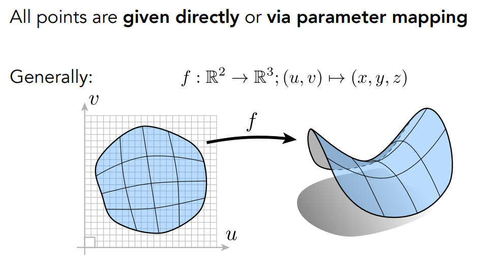

# Geometry

- [Introduction to geometry](#Introduction-to-geometry)
  - [Examples of geometry](#Examples-of-geometry)
  - [Various representations of geometry](#Various-representations-of-geometry)

## Introduction to geometry

### Examples of geometry

    
    

### Various representations of geometry

- 隐式表示
  - 
  - 水平集
  - 距离函数
- 显示表示
  - 点云
  - 多边形网格

    

#### Implicit Representations of Geometry

- 隐式表示
  - 根据点满足某种特定关系，而不是具体的位置。可以通过对这些点进行归类等
  - 只要满足$f(x,y,z)$=0的点就是几何的表面

    

-----

**Implicit Surface – Sampling Can Be Hard**

> 无法通过解析式看出几何形状，不容易找到所有的点

    

----

**Implicit Surface – Inside/Outside Tests Easy**

> 便于判断点是否在物体内或外

    

#### Explicit Representations of Geometry

> - 显示表达：
>   - 直接给出几何形状点的位置
>   - 通过参数映射的方式定义的表面

    

----

**Explicit Surface – Sampling Is Easy**

> 将$(u,v)$映射为$(x,y,z)$,可以很方便找到所有的点

    

----

**Explicit Surface – Inside/Outside Test Hard**

> 判断一个点是否在表面内/外较为困难

    

-----

**Best Representation  Depends on the Task!**

    

### Implicit Representations in  Computer Graphics

---

#### Algebraic Surfaces (Implicit)

> 缺点：不直观

    

----

#### Constructive Solid Geometry (Implicit)

> CSG：通过基本几何的基本布尔运算获取复杂的结合。**非常常见的建模方法**

    

-----

#### Distance Functions (Implicit)

> - 距离函数
>   - 对于任何一个几何，描述点到几何平面的最小距离，该距离可以是正的，也可以是负的。
>   - 可以将两个几何的距离函数进行融合(blend)，从而获得融合后的几何形状

    

> - SDF:有符号距离
>   - 两个物体A和B分别挡住了视口的$1/3,2/3$,求出物体从左到右移动过程的中间状态。如果做线性的blend，则是左边黑色，中间灰色，右边白色，没有展示运动过程的效果。（希望的左边一半是黑的，一半是灰的；中间一半是灰的，一半是白的）
>   - 使用SDF可以模拟这种效果

    

- **Blending Distance Functions (Implicit)**

> 任何物体的距离函数，然后进行融合

    

- Scene of Pure Distance Functions

    

----

#### Level Set Methods (Also implicit)

> - 水平集方法：
>   - 与DF一样，只是函数的表示写在格子中。$f(x)=0$等高线

    

- Level Sets from Medical Data (CT, MRI, etc.)

    

- Level Sets in Physical Simulation

    

----

**Fractals (Implicit)** 分形

    

#### Implicit Representations - Pros & Cons

- Pros:  
  - compact description (e.g., a function) 
  - certain queries easy (inside object, distance to surface)  
  - good for ray-to-surface intersection (more later)  容易做光线求交
  - for simple shapes, exact description / no sampling error
  - easy to handle changes in topology (e.g., fluid)  容易表示拓扑
- Cons:  
  - difficult to model complex shapes 复杂场景难以表示，如奶牛

### Explicit Representations in  Computer Graphics

- Many Explicit Representations in Graphics
  - 三角形网格
  - Bezier曲面

    

#### Point Cloud (Explicit)

    

#### Polygon Mesh (Explicit)

> 最广泛的使用

    

**The Wavefront Object File (.obj) Format**

>  三角形面表示物体的文件格式：文本文件，点，法线，纹理坐标分开存储
>
> 立方体例子（存在冗余）：
>
> - v: 8个点
> - vn：6个面的6种不同的法线
> - vt：12个纹理坐标
> - f：三角形点的连接情况，(v/vt/vn)下标

    

## Curves

> 曲线：显示几何

### Bézier Curves

> 贝塞尔曲线（显示表示方法）：关于参数t的曲线
>
> - 使用一系列的控制点去定义一条曲线，沿着某一方向，必须经过起止点

---

**Defining Cubic Bézier Curve With Tangents**

    

----

**Evaluating Bézier Curves  (de Casteljau Algorithm)**

- Consider three points (quadratic Bezier) 二次贝塞尔曲线

- Insert a point using linear interpolation 假设起点在时间0，终点在时间1，找出时间t点在哪里。
  - 先假设起始点为$b_0b_1$，找到$t$对应的点$b_0^1$

 
    

- Insert on both edges
  - 然后假设起始点为$b_1b_2$，找到$t$时刻对应的点$b_1^1$

    

- Repeat recursively
  - 最后假设起始点为$b_0^1b_1^1$，找到$t$对应点$b_0^2$。这就是最终的结果

    

- Run the same algorithm for every t in [0,1]

    

---

**Four input points in total** 递归求解

    

> Animation: Steven Wittens, Making Things with Maths, http://acko.net

### Bézier Curves  Algebraic Formula

> - 每两个点之间做线性插值
> - 重复构造

    

- 二次贝塞尔曲线示例

    

- 由所有控制点的线性组合而成，系数是个多项式(Bernstein polynomial) 二项分布

    

- 示例：空间点也可以成立

    

---

**Cubic Bézier Basis Functions**

    

- **Properties of Bézier Curves**
  - 在**仿射变换**下保持不变：将空间点进行仿射变换后画出的曲线与原始点画出的曲线经过仿射变换后的结果相同
  - 凸包性质：曲线一点在几个控制点的凸包内

    

> 凸包：包含所有点的最小多边形

    

### Piecewise Bézier Curves

> 逐段贝塞尔曲线

- Higher-Order Bézier Curves?
  - 高阶贝塞尔曲线形成的曲线不容易控制

    

- Piecewise Bézier Curves 逐段，**通常是4个点** PS种的钢笔工具，沿着两边可以拉动曲线
  - demo: David Eck, http://math.hws.edu/eck/cs424/notes2013/canvas/bezier.html
  - 曲线连续：导数要连续，控制杆两端等距共线

    

- Piecewise Bézier Curve – Continuity 连续性

- $C^0$连续：第一段终止点是第二段的起始点

    

- $C^1$ continuity：第2段也是连续（一阶导数连续）

    

----

**Other types of splines**

- Spline(样条)

    

- B-splines 基函数样条，贝塞尔曲线的扩展，极其复杂

    

> 更多曲线学习(NURBS)：Prof. Shi-Min Hu’s course: https://www.bilibili.com/video/ av66548502?from=search&seid=65256805876131485

## Surfaces

### Bézier Surfaces

    

**Bicubic Bézier Surface Patch**

> 贝塞尔曲线–>贝塞尔曲面：4*4控制点

**Visualizing Bicubic Bézier Surface Patch**

> - 在两个方向上使用贝塞尔曲线–> 双线性插值
>
> - Animation: Steven Wittens, Making Things with Maths, http://acko.net

### Evaluating Bézier Surfaces

**Evaluating Surface Position For Parameters (u,v)**

> 两个时间$u,v$

**Method: Separable 1D de Casteljau Algorithm**

> 先沿着$u$找4个点，然后沿着$v$。显示表示–>参数映射形式

### Mesh Operations: Geometry Processing

> 几何处理：网格细化，网格简化，网格正规化

