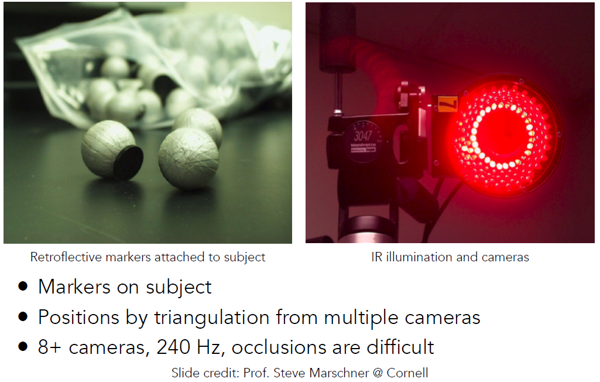

# Animation

[toc]

**Animation**

- “Bring things to life”
  - Communication tool
  - Aesthetic issues often dominate technical issues
- An extension of modeling
  - Represent scene models as a function of time 时间的函数
- Output: sequence of images that when viewed sequentially
  provide a sense of motion
  - Film: 24 frames per second
  - Video (in general): 30 fps
  - Virtual reality: 90 fps 对帧率要求非常高（保证不晕）

## Keyframe Animation

> 关键帧动画

**Keyframe Interpolation**

> 关键帧插值

**Keyframe Interpolation of Each Parameter**

> - 线性插值
> - 平滑插值

## Physical Simulation

**Newton’s Law**

> 物理模拟：符合牛顿定律。实现各种物理公式

**Physically Based Animation**

> 有限元分析：衣服上任何一个点都收到力的作用

**Example: Fluids**

> 流体力学仿真：模拟水的运动，然后再渲染

## Mass Spring System

> 质点弹簧系统：模拟任一点的作用。

**Example of Modeling a Dynamic System**

**A Simple Spring**

> 质点弹簧系统：一个弹簧连接两个质点。符合胡克定律。

**Non-Zero Length Spring**

> 弹簧程度为$l$，分析时只考虑拉伸。由于能量守恒，弹簧会一直振动。

**Dot Notation for Derivatives**

> 导数表示

**Introducing Energy Loss**

> 引入摩擦力，让弹簧可以停下来。与速度成比例。这样会导致所有的运动都会停下来。无法表示弹簧内部的损耗。

**Internal Damping for Spring**

> 弹簧内部的损耗，与相对速度有关。引入单位方向进行点乘，就是将相对速度投影在$ab$方向上，因为如果是$a$绕着$b$旋转，在弹簧内部不应该存在损耗

------

**Structures from Springs**

> 弹簧组合

**Structures from Springs**

> - 模拟布并不合理，因为该模型无法应对切变。
> - 这种结构不会抵抗平面外弯曲，比如对折

> 加入对角线，拉动时不会发生形变，但不对称。

**Structures from Springs**

> 继续加入对角线，可以抵抗切变；但不能抵抗非平面的弯曲

**Structures from Springs**

> 任意一个点与隔一个点的点相连。无论做什么形变，都会引起弹簧的变化

**Aside: FEM (Finite Element Method) Instead of Springs**

> 有限元分析方法：适用于力的传导、力的扩散

## Particle Systems

> 粒子系统

**Particle Systems**

> - 每个粒子单独建模，并定义单个粒子所受到的力
> - 挑战：粒子越多，效果越好，越慢；粒子内部作用力复杂（碰撞、引力等）

**Particle System Animations**

> 粒子系统动画算法：如何解很困难

**Particle System Forces**

> 粒子作用力：引力、电磁力、摩擦力、阻力、碰撞。。。

**Gravitational Attraction**

> 万有引力

**Example: Particle-Based Fluids**

**Simulated Flocking as an ODE**

> 粒子可以模拟群体行为，比如模拟鸟群之间的状态

**Example: Molecular Dynamics**

> 粒子模拟分子运动

## Forward Kinematics

> 正向运动学

**Forward Kinematics**

> 骨骼系统：三种类型的关节（Pin, Ball, Prismatic joint）

> 每个关节的运动情况，推断最终点在哪

> 数学关系计算

> 关节的运动可以定义为时间的函数

> 运动示例：

**Example Walk Cycle**

> **运动学：**
>
> - 实现容易
> - 与物体不一致

**Kinematics Pros and Cons**

## Inverse Kinematics

> 逆运动学：假设可以移动尖端，然后可以自动调节关节的运动来达到目的点

**Inverse Kinematics**

> 已知P点，求解关节的角度

> 解非常复杂

> 解不唯一

> 解不唯一

> 解不一定存在

> 逆运动学：
>
> - 可以使用梯度下降等凸优化方法来求解

**Inverse Kinematics**

## Rigging

> 绑定（木偶）：对于一个形状的控制，空过控制点进行控制（3D种的贝塞尔曲线）。软选取，蒙皮等操作

**Rigging Example**

**Blend Shapes**

> 控制点之间可以进行插值，来细化控制

## Motion Capture

> 动作捕捉

**Motion Capture Pros and Cons**

> - 真实感
> - 设备昂贵，捕捉不一定精确

**Motion Capture Equipment**

> 动捕设备：
>
> - 光流：反光点 光学动捕
> - 磁力
> - 机械

**Optical Motion Capture**

> 光学动捕：物体贴片，多相机！！！

> 实际动捕场景，好昂贵

> 一个控制点的运动轨迹

**Motion Data**

> 恐怖谷效应：人类害怕过于真实的。。。

**Challenges of Facial Animation**

**Facial Motion Capture**

> 面部动捕

**The Production Pipeline**

> 动画生成过程

## Animation Cont.

### Single particle simulation

**Single Particle Simulation**

> 单粒子模拟：粒子在速度场（任何位置的速度都已知）中的运动$v(x,t)$。

**Ordinary Differential Equation (ODE)**

> 一阶常微分方程（ODE）：根据$v(x,t)$求出$x$

**Solving for Particle Position**

> 求解：设起点为$x_0$

**Euler’s Method**

> 欧拉方法：
>
> - 对时间进行离散化。在上一个时刻的位置上加上一个扰动，求取下一时刻的位置。
>
> - 始终只用上一个位置去估计下一时刻的位置
> - 会迅速变得不稳定

**Euler’s Method - Errors**

> - 欧拉误差：扰动时间的大小很重要，扰动时间越小，误差越小

**Instability of the Euler Method**

> 稳定性：不管取多大的步长（扰动时间），如果每个位置的速度变化较大，会导致不稳定。

> 误差和稳定性：步长较小，可以较低误差；diverge不稳定会越来越大

**Errors and Instability**

**Instability: A Disastrous Example**

### Combating Instability

> 对抗不稳定

**Some Methods to Combat Instability**

**Midpoint Method**

> 中点法：先使用一半扰动时间到达终点，然后用**中点的速度**当作整个扰动时间的速度

>  中点法多了二次项，模拟了局部的曲线

**Adaptive Step Size**

> 自适应步长法：把扰动时间分为两半使用欧拉方法进行计算。如果分开计算的结果差异大于某一阈值，则继续划分。（信赖区域法）

**Implicit Euler Method**

**Implicit Euler Method**

> 隐式（后向）欧拉方法：使用下一时间的速度、加速度来更新下一时刻的位置。更加稳定

> 局部误差（Truncation error）
>
> 累积误差（total accumulated error）
>
> - 研究误差与扰动时间的关系，从而添加合理的扰动，以期待到达下一个位置误差更小
> - $O(h)$：如果h减少一半，则误差也减少一半

**Runge-Kutta Families**

> 龙格库塔方法：擅长求解非线性微分方程
>
> - 常用四阶方法：RK4 $O(h^4)$：$h$减小一半，误差降低到$1/16$

**Position-Based / Verlet Integration**

> 基于位置的/Verlet集成

### Rigid body simulation

> 刚体模拟：不会发生形变。可以当作一个粒子的运动，并添加额外的物理量

### Fluid simulation

> 流体模拟

**A Simple Position-Based Method**

> - 假设水是由无法刚体粒子组成，先模拟出不同粒子的运动，再通过渲染转换为各种流体
> - 流体不可压缩，即任何时刻任何位置的密度一样  —> 给定任何时刻，都可以知道任何位置的密度。如果存在变化，则需要通过移动粒子来修正密度
> - 密度是关于位置的函数，求解任何一个点的密度与位置的导数，就可以进行修正！！！—- 梯度下降法

**Eulerian vs. Lagrangian** 模拟的两种不同思路

> - 欧拉方法：将整个空间分为不同的网格，只考虑网格随着时间的变化
> - 拉格朗日方法（质点法）：将空间看作不同的粒子，模拟单个粒子随时间的运动

**Material Point Method (MPM)**

> 混合表示方法：拉格朗日+欧拉。假设每个粒子带有材质信息，把运动看作网格运动，然后把网格又转换为粒子属性

**Congratulations!**

